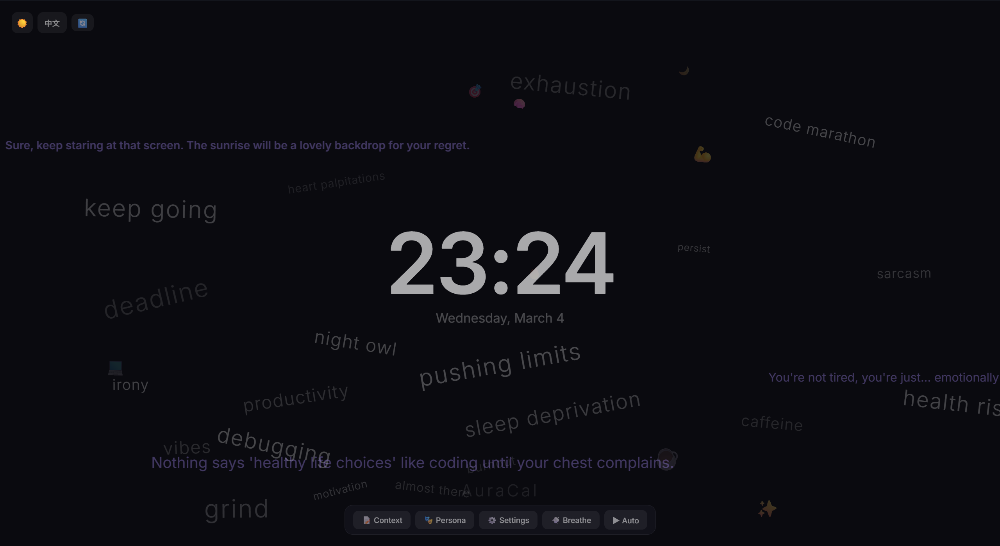
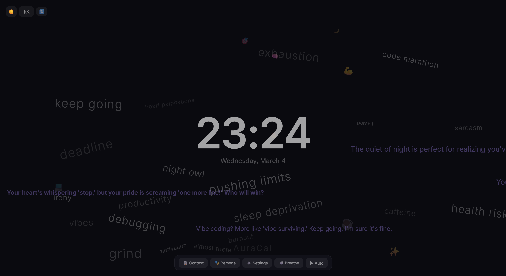
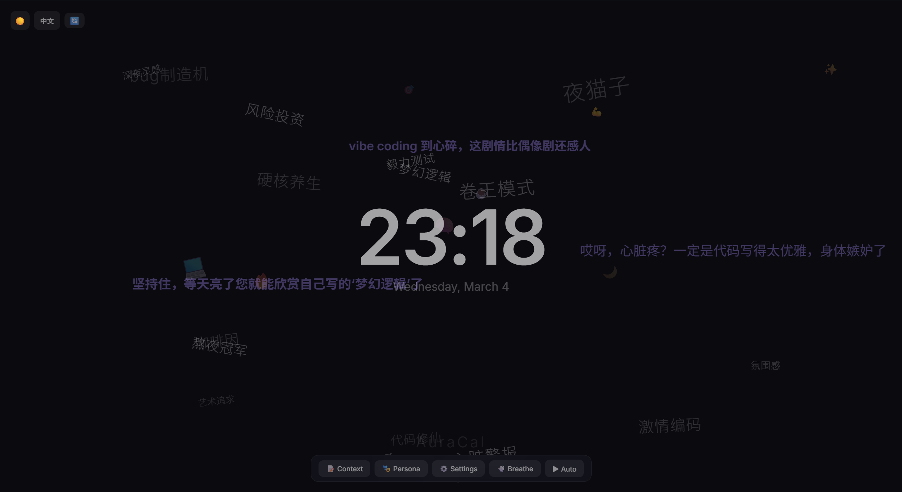
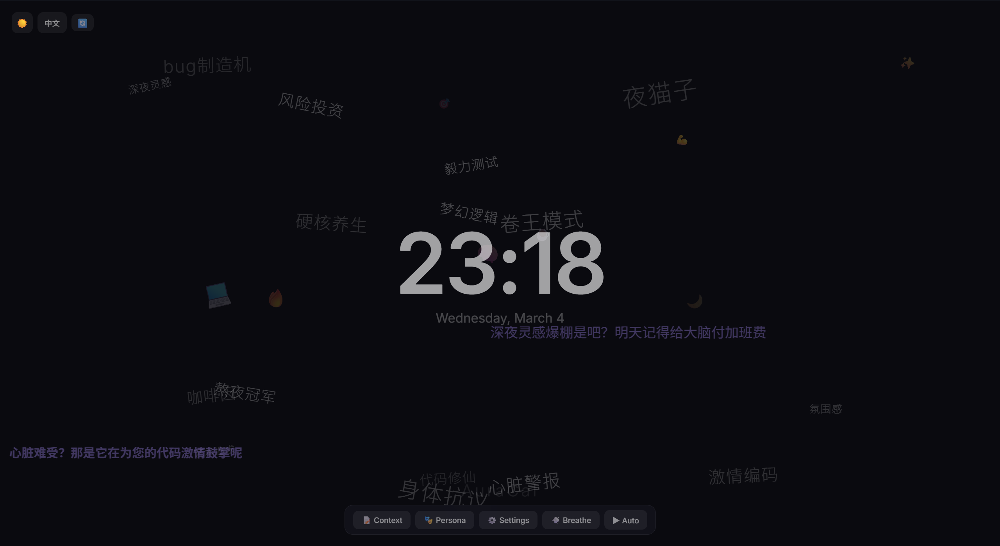

# 📅 AuraCal

**A Breathing, Persona-Driven Ambient Display.**

[中文文档](README_CN.md) | **Live Demo: https://lulusiyuyu.github.io/AuraCal/**

AuraCal is not a traditional to-do list — it's a **living desktop art piece** with a soul. Through AI personas, it breathes poetic danmaku messages and floating word clouds across your screen, perfect for focus sessions, café displays, or brand promotions.

> 🧽 *"I'm ready! Today you're gonna crush everything!"* — SpongeBob Persona

<p align="center">
  
  
</p>
<p align="center">
  
  
</p>

---

## ✨ Features

- **🎭 7 AI Personas** — Sarcasm King, Study Buddy, Promoter, SpongeBob, Strict Coach, Hot-blooded Trainer, Zen Master + custom persona creation
- **💨 Breathing Engine** — AI generates danmaku messages every N minutes with time-aware context
- **📝 Custom Context** — Tell the AI about your goals, schedule, or product info
- **☁️ Word Cloud** — Floating background keywords with organic spring animations
- **🎬 GPU-Accelerated Danmaku** — Pure CSS `translate3d` animations, transparent overlay, clock always on top
- **🌐 i18n** — Full English + Chinese support (UI, AI output, date formats)
- **🌗 Dark/Light Theme** — Apple-inspired minimalist design with smooth transitions
- **🤖 Multi-AI Provider** — DeepSeek, OpenAI, MiniMax, or any OpenAI-compatible API
- **🔒 Privacy-First** — Pure frontend SPA, API keys stored in browser localStorage only, **no backend server**
- **📱 Auto-hide UI** — Toolbar and controls hide after 3s of inactivity for a clean display

---

## 🏗️ Tech Stack

| Layer | Technology |
|-------|-----------|
| Framework | React 19 + Vite + TypeScript |
| State | Zustand (localStorage persistence) |
| Animation | Framer Motion + CSS `translate3d` (GPU) |
| AI | Direct `fetch` to OpenAI-compatible APIs (no SDK) |
| Hosting | GitHub Pages (static SPA, zero backend) |

---

## 🚀 Quick Start

### Online

Visit **https://lulusiyuyu.github.io/AuraCal/**, configure your AI API key in ⚙️ Settings, and click 💨 Breathe!

### Local Development

```bash
git clone https://github.com/lulusiyuyu/AuraCal.git
cd AuraCal/frontend
npm install
npm run dev
```

Open **http://localhost:5173** — that's it, no backend needed.

---

## ⚙️ Configuration

All settings are stored in your browser's localStorage:

| Setting | Where | Description |
|---------|-------|-------------|
| AI Provider | ⚙️ Settings | DeepSeek (default), OpenAI, MiniMax, or custom |
| API Key | ⚙️ Settings | Your AI provider API key (never leaves browser) |
| Persona | 🎭 Persona | Choose from 7 built-in or create custom |
| Context | 📝 Context | Tell the AI what you're doing today |
| Breathing Interval | ⚙️ Settings | Auto-breathe timer (minutes) |
| Theme | 🌗 Toggle | Dark / Light |
| Language | 🌐 Toggle | English / 中文 |

---

## 🎭 Built-in Personas

| # | Name | Style | Best For |
|---|------|-------|----------|
| 1 | 阴阳大师 (Sarcasm King) | Sarcastic, witty | Fun motivation (default) |
| 2 | 自习监督员 (Study Buddy) | Warm, encouraging | Study sessions |
| 3 | Promoter | Creative ad copywriter | Café/shop displays |
| 4 | 海绵宝宝 (SpongeBob) | Energetic, funny | Mood boost |
| 5 | 暴躁导师 (Strict Coach) | Harsh, no-nonsense | Productivity |
| 6 | 热血教练 (Trainer) | Passionate, inspiring | Sports/fitness |
| 7 | 禅意大师 (Zen Master) | Calm, poetic | Focus/meditation |

💡 **Promoter tip**: Set your custom context to your product info (e.g., *"Ethiopian Yirgacheffe single origin, light roast, notes of blueberry and jasmine ☕"*) and watch the AI generate catchy ad copy on your display!

---

## 📁 Project Structure

```
AuraCal/
├── frontend/
│   ├── package.json
│   ├── vite.config.ts
│   ├── index.html
│   └── src/
│       ├── App.tsx                 # Root component (auto-hide toolbar)
│       ├── main.tsx                # Vite entry
│       ├── i18n.ts                 # EN/ZH translations
│       ├── index.css               # Dark/light theme system
│       ├── stores/
│       │   └── ambientStore.ts     # Zustand state (localStorage persist)
│       ├── hooks/
│       │   └── useBreathing.ts     # Breathing timer + AI trigger
│       ├── services/
│       │   ├── aiProvider.ts       # Direct fetch to AI APIs
│       │   ├── promptEngine.ts     # Time-aware prompt assembly
│       │   └── breathEngine.ts     # Orchestrates prompt → AI → parse
│       ├── data/
│       │   ├── builtinPersonas.ts  # 7 built-in personas (bilingual)
│       │   └── aiProviders.ts      # Provider presets
│       └── components/
│           ├── DanmakuLayer.tsx     # GPU-accelerated danmaku
│           ├── WordCloudLayer.tsx   # Floating word cloud
│           ├── ClockWidget.tsx      # Center clock
│           ├── BreathingText.tsx    # Breathing animation text
│           ├── ContextEditor.tsx    # Custom context editor
│           ├── PersonaManager.tsx   # Persona selection + CRUD
│           ├── SettingsPanel.tsx    # AI config panel
│           ├── ThemeToggle.tsx      # Dark/light toggle
│           └── LanguageToggle.tsx   # EN/ZH toggle
├── docs/screenshots/               # Demo screenshots
├── .github/workflows/deploy.yml    # GitHub Pages CI/CD
└── LICENSE
```

---

## 📄 License

MIT License — see [LICENSE](LICENSE)
