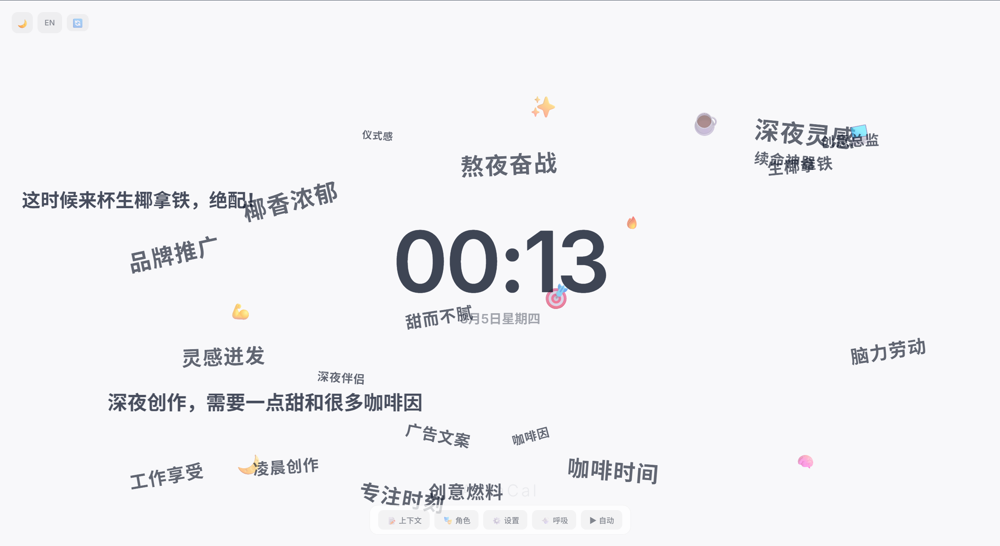
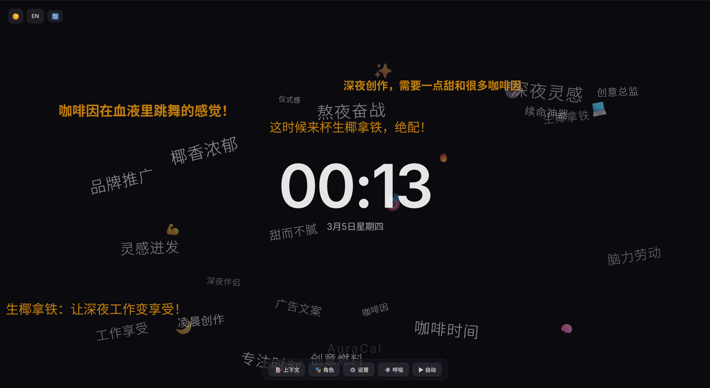

# 📅 AuraCal 灵光画布

**一个会呼吸的、人格驱动的极简氛围展示屏。**

[English](README.md) | **在线体验：https://lulusiyuyu.github.io/AuraCal/**

AuraCal 是一件**有灵魂的桌面数字艺术品**。它通过呼吸引擎与 AI 人格角色，在你的屏幕上推送带有情绪色彩的满屏弹幕与悬浮词云，适合专注学习、咖啡店展示、品牌宣传等场景。

> 🧽 *"我准备好了！今天的你，一定能搞定所有事！"* — 海绵宝宝人格

<p align="center">
  
</p>
<p align="center">
  
</p>
<p align="center">
  
</p>
<p align="center">
  
</p>
<p align="center">
  
</p>
<p align="center">
  
</p>

---

## ✨ 核心功能

- **🎭 7 个 AI 人格** — 阴阳大师、自习监督员、宣传员、海绵宝宝、暴躁导师、热血教练、禅意大师 + 自定义角色创建
- **💨 呼吸引擎** — AI 基于当前时间上下文与角色设定，定时生成弹幕与词云
- **📝 自定义上下文** — 告诉 AI 你今天的目标或心情（如：`"今天必须看完数据结构第三章"`）
- **☁️ 环境式词云与弹幕** — Framer Motion 物理动画，词云背景缓动，弹幕前景漂浮
- **🌐 中英双语** — UI、AI 输出、日期格式全面双语切换
- **🌗 明暗主题** — Apple 风格极简美学，丝滑过渡
- **🤖 多模型支持** — DeepSeek、OpenAI、MiniMax 及任何 OpenAI 兼容 API
- **🔒 隐私优先** — 纯前端 SPA，API Key 仅存浏览器本地，**无后端服务器**
- **📱 自动隐藏 UI** — 3 秒无操作自动隐藏工具栏，纯净展示

---

## 🏗️ 技术栈

| 层 | 技术 |
|---|---|
| 框架 | React 19 + Vite + TypeScript |
| 状态管理 | Zustand（localStorage 持久化） |
| 动画 | Framer Motion + CSS `translate3d`（GPU 加速） |
| AI | 直接 `fetch` 调用 OpenAI 兼容 API（无 SDK） |
| 部署 | GitHub Pages（纯静态 SPA，零运维） |

---

## 🚀 快速开始

### 在线体验

访问 **https://lulusiyuyu.github.io/AuraCal/**，在 ⚙️ 设置中填入你的 AI API Key，点击 💨 即可开始呼吸！

### 本地开发

```bash
git clone https://github.com/lulusiyuyu/AuraCal.git
cd AuraCal/frontend
npm install
npm run dev
```

打开 **http://localhost:5173** — 就这么简单，不需要后端。

---

## ⚙️ 使用指南

1. **配置 AI Key**：点击底部 `⚙️ 设置`，选择 AI 提供商并填入 API Key（存在浏览器本地）
2. **选择人格**：点击 `🎭 人格`，选一个最贴合你此刻心境的角色
3. **补充语境（可选）**：通过 `📝 上下文` 告诉它你正在做什么
4. **开始呼吸**：点击底栏 **💨** 按钮手动触发，或点 **Auto** 开启自动循环
5. **重置**：点击左上角 🔄 按钮清空当前弹幕和词云

---

## 🎭 内置人格

| # | 名称 | 风格 | 适用场景 |
|---|------|------|----------|
| 1 | 阴阳大师 (Sarcasm King) | 阴阳怪气，反话正说 | 趣味激励（默认） |
| 2 | 自习监督员 (Study Buddy) | 温暖陪伴，督促学习 | 自习/考试复习 |
| 3 | 宣传员 (Promoter) | 广告文案创意 | 咖啡店/商店展示 |
| 4 | 海绵宝宝 (SpongeBob) | 搞笑乐观 | 提升心情 |
| 5 | 暴躁导师 (Strict Coach) | 严厉痛骂 | 高效产出 |
| 6 | 热血教练 (Trainer) | 激情励志 | 运动/健身 |
| 7 | 禅意大师 (Zen Master) | 禅意诗意 | 专注/冥想 |

💡 **宣传员技巧**：在上下文中输入你的产品信息（如：*"埃塞俄比亚耶加雪菲单品，浅烘，蓝莓茉莉风味 ☕"*），AI 会不断生成创意广告文案在屏幕上滚动！

---

## 📁 项目结构

```
AuraCal/
├── frontend/
│   ├── package.json
│   ├── vite.config.ts
│   └── src/
│       ├── App.tsx                 # 根组件（自动隐藏工具栏）
│       ├── i18n.ts                 # 中英文翻译
│       ├── index.css               # 明暗主题系统
│       ├── stores/ambientStore.ts  # Zustand 状态管理
│       ├── hooks/useBreathing.ts   # 呼吸定时器 + AI 触发
│       ├── services/               # AI 调用 + Prompt 组装 + JSON 解析
│       ├── data/                   # 内置人格 + AI 提供商预设
│       └── components/             # 弹幕、词云、时钟、设置面板等
├── docs/screenshots/               # 展示截图
├── .github/workflows/deploy.yml    # GitHub Pages 自动部署
└── LICENSE
```

---

## 📄 License

MIT — 详见 [LICENSE](LICENSE)
